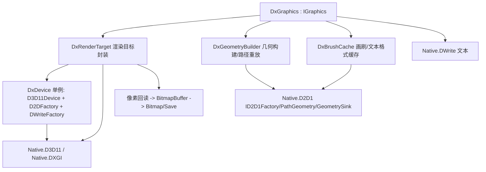

## 用户需求（原始意图）

在空白项目 `src\DXApi\DXApi.vbproj` 中用 VB.NET 编写一套**纯托管代码**的 DirectX 互操作层（全部通过 P/Invoke 调用 DirectX COM API，不引入任何非托管 dll 工程），提供 GPU 加速的 2D 作图能力；随后在 `src\DXApi\DxGraphics.vb` 中基于该 API 实现 `IGraphics` 图形对象；最后在 `src\Microsoft.VisualBasic.Drawing\test\test.vbproj` 中增加针对 `DxGraphics` 的 demo，重点验证"大量多边形对象"场景下的绘图性能提升。

## 已确认的补充与选型

- **技术路线**：Direct2D + D3D11/DXGI。P/Invoke `d2d1.dll`/`d3d11.dll`/`dxgi.dll`/`dwrite.dll`；创建带 `D3D11_CREATE_DEVICE_BGRA_SUPPORT` 的 D3D11 设备与 DXGI 纹理，通过 `ID2D1Factory::CreateDxgiSurfaceRenderTarget` 得到 GPU 渲染目标；多边形用 `ID2D1PathGeometry` + `FillGeometry`/`DrawGeometry`。
- **接口范围**：`IGraphics` 全部接口都要实现，Arc/Bezier/Curve/Pie/ClosedCurve 等全部重载统一转为 Direct2D 几何路径。
- **测试基准**：以 SkiaSharp 的 `SkiaGraphics` 为对照组，相同数量与尺寸的多边形分别在两种画布上绘制，Stopwatch 计时对比、输出加速比，并各自导出图片文件供肉眼比对。

## 产品概述

一个可插拔的 DirectX 2D 图形后端：底层是纯托管的 DirectX P/Invoke 声明与资源封装，中层是 GPU 渲染目标与几何/画刷缓存，上层是完整实现 `IGraphics` 的 `DxGraphics`。对外与现有 Skia 光栅画布 API 完全一致，可直接替换。

## 核心特性

- DirectX 互操作层：DXGI/D3D11/Direct2D/DirectWrite 的 COM 接口、结构体、枚举的托管声明，含 HRESULT 校验与安全释放。
- GPU 渲染目标：D3D11 纹理离屏渲染 + Direct2D 绘制 + 纹理回读为像素缓冲，可导出位图文件。
- 完整 2D 作图能力：多边形、矩形、椭圆、弧、贝塞尔、曲线、饼、路径、文本、图像、变换、裁剪、清空。
- 性能优化：画刷缓存、文本格式缓存、同色多边形批量几何合并（单路径多图元、一次 FillGeometry）。
- 健壮性：无 GPU 环境自动回退 WARP 软件光栅驱动。
- 性能对比 demo：可配置多边形数量，Skia 与 DirectX 双画布同时跑，输出耗时、加速比与结果图。

## 技术栈

- 语言/框架：VB.NET，`net10.0-windows`，`Platforms=AnyCPU;x64`（沿用 `DXApi.vbproj` 现有配置）
- 互操作方式：`System.Runtime.InteropServices` 的 `DllImport` + `ComImport`/`Guid`/`PreserveSig` 声明（100% 托管，不使用 C++/CLI、不使用 `unsafe`）
- 依赖：仅现有 `Core.vbproj`（`IGraphics`/`Pen`/`Brush`/`Font`/`GraphicsPath`/`Image`/`BitmapBuffer`）与 `Math.NET5.vbproj`，**不新增 NuGet**
- 对照基准：测试项目已有的 SkiaSharp（`Microsoft.VisualBasic.Drawing.Graphics` : `SkiaGraphics`）

## 实现方案

### 总体策略

分三层：Native 声明层（DirectX COM 契约）→ 资源封装层（设备/渲染目标/几何/画刷）→ 图形适配层（`DxGraphics : IGraphics`）。渲染结果从 GPU 纹理回读为 BGRA/ARGB 字节数组，包装成 `Microsoft.VisualBasic.Imaging.Bitmap` 以便 `Save` 出图，与现有 Skia 驱动保持一致的对外行为。

### 渲染管线（关键决策）

1. `D3D11CreateDevice`（`D3D_DRIVER_TYPE_HARDWARE`，`D3D11_CREATE_DEVICE_BGRA_SUPPORT`；失败回退 `D3D_DRIVER_TYPE_WARP`）
2. 创建 `ID3D11Texture2D`：`DXGI_FORMAT_B8G8R8A8_UNORM`，`BindFlags = RENDER_TARGET`，`MiscFlags = 0`（D2D 需要可共享的 DXGI 表面）
3. `ID3D11Texture2D → IDXGISurface`（QueryInterface）
4. `ID2D1Factory::CreateDxgiSurfaceRenderTarget`，像素格式 `DXGI_FORMAT_B8G8R8A8_UNORM` + `D2D1_ALPHA_MODE_PREMULTIPLIED`
5. 绘制期间不显式 BeginDraw/EndDraw（每次绘制调用即提交），导出前 `ID2D1RenderTarget::Flush`
6. 回读：预建一张 `USAGE_STAGING` + `CPU_ACCESS_READ` 的同尺寸纹理，`CopySubresourceRegion` → `Map` → `Marshal.Copy` → `Unmap`，得到 ARGB 字节数组

> 说明：选择 Direct2D 而非自写 HLSL，是因为 Direct2D 原生提供几何填充、抗锯齿、描边样式与 DirectWrite 文本，避免自行实现多边形三角化与字体排版，风险与工作量显著更低，且同样走 GPU 光栅化。

### 性能要点

- **画刷缓存**：`Dictionary(Of Color, ID2D1SolidColorBrush)`，避免每次 `FillPolygon` 创建/释放画刷。
- **文本格式缓存**：`Dictionary(Of String, IDWriteTextFormat)`，键为 `fontName|size|bold|italic`。
- **批量几何合并**（性能胜负手）：`DxGraphics` 提供批量填充模式——当连续多个多边形使用同一纯色画刷时，把每个多边形作为一个 **figure** 追加进同一个 `ID2D1PathGeometry`，最后一次 `FillGeometry` 提交，把 N 次 GPU 提交压成 1 次。默认关闭以保证绘制顺序语义，demo 中显式开启。
- **描边**：`ID2D1RenderTarget::DrawGeometry` + 按 `(Color, Width)` 缓存的画刷，虚线走 `ID2D1StrokeStyle`。
- 复杂度：单次多边形填充 O(k)（k 为顶点数），GPU 侧并行光栅化；批量模式把调用开销从 O(N) 降到 O(批次)。

### 可靠性与兼容

- `Drivers` 枚举位于工作区外的 GCModeller，**不修改**；`DxGraphics.Driver` 保持返回 `Drivers.GDI`（输出为光栅图），与现有 stub 一致。
- COM vtable 声明易出错：先写最小冒烟程序验证 `CreateDxgiSurfaceRenderTarget` 成功，再铺开全接口实现。
- 所有 COM 指针释放走统一的 `SafeRelease`，`ReleaseHandle()` 中释放渲染目标与纹理，保留设备供后续画布复用（进程内单例）。

## 实现注意事项

- `IGraphics` 位于 `Microsoft.VisualBasic.Imaging` 命名空间，其 `Pen`/`Brush`/`Font`/`GraphicsPath` 均为该命名空间下的自绘值类型（非 `System.Drawing`），`DxGraphics` 必须 `Imports Microsoft.VisualBasic.Imaging` 并避免与 `System.Drawing` 同名类型冲突（用 `Imports Pen = Microsoft.VisualBasic.Imaging.Pen` 等别名，参照 `SkiaGraphics.vb` 的做法）。
- `Size` 是 `Overrides ReadOnly Property`，只能在构造函数中赋值（参照 `SkiaGraphics.New`）。
- `GraphicsPath` 是 `Enumeration(Of op)` 指令流（op_AddLine/AddBezier/AddPolygon/AddEllipse/AddArc/AddPie/AddCurve/AddClosedCurve/StartFigure/CloseFigure 等），`DrawPath`/`FillPath` 需遍历 op 重放到 `ID2D1GeometrySink`。实际子类型清单以源码为准，实现前需确认。
- 回读得到的 Direct2D 像素是 **预乘 alpha 的 BGRA**，写回 `BitmapBuffer` 前需转为 ARGB 并反预乘。
- 文本绘制用 `Marshal.StringToCoTaskMemUni` 传 `DrawText` 的 `wchar*`；`MeasureString` 用 `IDWriteTextLayout::GetMetrics`。
- 日志沿用 GCModeller 的 `.warning` 扩展；HRESULT 失败抛出带 `HRESULT` 值的 `ExternalException`，不含大块像素数据。

## 架构设计



## 目录结构

```
src/DXApi/
├── DXApi.vbproj                     # [MODIFY] 视需要补充 <NoWarn>/程序集说明，引用保持不变
├── Native/
│   ├── ComBase.vb                   # [NEW] HRESULT 校验 ThrowIfFailed、SafeRelease、D2D1_COLOR_F/D2D1_POINT_2F/
│   │                                #        D2D1_RECT_F/D2D1_MATRIX_3X2_F 等基础结构与 Guid 常量
│   ├── DXGI.vb                      # [NEW] dxgi.dll：CreateDXGIFactory1、IDXGIFactory1、IDXGISurface、
│   │                                #        DXGI_FORMAT/DXGI_SAMPLE_DESC
│   ├── D3D11.vb                     # [NEW] d3d11.dll：D3D11CreateDevice、ID3D11Device、ID3D11DeviceContext、
│   │                                #        ID3D11Texture2D（含 Map/Unmap/CopySubresourceRegion）、
│   │                                #        D3D11_TEXTURE2D_DESC / D3D11_MAPPED_SUBRESOURCE / 特性等级枚举
│   ├── D2D1.vb                      # [NEW] d2d1.dll：D2D1CreateFactory、ID2D1Factory、ID2D1RenderTarget、
│   │                                #        ID2D1SolidColorBrush、ID2D1PathGeometry、ID2D1GeometrySink、
│   │                                #        ID2D1EllipseGeometry、ID2D1RectangleGeometry、ID2D1Bitmap、
│   │                                #        ID2D1StrokeStyle 及渲染目标属性/枚举
│   └── DWrite.vb                    # [NEW] dwrite.dll：DWriteCreateFactory、IDWriteFactory、
│                                    #        IDWriteTextFormat、IDWriteTextLayout、DWRITE_TEXT_METRICS 与字重/样式枚举
├── Interop/
│   ├── DxPixelFormat.vb             # [NEW] Color→D2D1_COLOR_F、BGRA 预乘缓冲 ↔ ARGB 字节数组互转
│   └── DxPathBuilder.vb             # [NEW] PointF()/Rectangle/Ellipse/Arc/Bezier/Curve/Pie 构造几何；
│                                    #        GraphicsPath 的 op 指令流重放到 ID2D1GeometrySink
├── DxDevice.vb                      # [NEW] 进程内单例：创建 D3D11 设备（BGRA，硬件失败回退 WARP）、
│                                    #        D2D 工厂、DWrite 工厂；统一释放
├── DxRenderTarget.vb                # [NEW] 指定尺寸的 GPU 离屏渲染目标：纹理/IDXGISurface/D2D 渲染目标/暂存纹理，
│                                    #        Flush、ReadPixels 回读、Dispose
├── DxBrushCache.vb                  # [NEW] 纯色画刷缓存、描边样式缓存、文本格式缓存、批量几何累加器（同色多图元合并）
└── DxGraphics.vb                    # [MODIFY] 完整实现 IGraphics 全部成员（清除全部 NotImplementedException），
                                     #          并实现 GdiRasterGraphics.ImageResource 与 Save 出图

src/Microsoft.VisualBasic.Drawing/test/
├── DxBenchmark.vb                   # [NEW] 多边形性能对比 demo：生成 N 个随机多边形，分别在
│                                    #        Microsoft.VisualBasic.Drawing.Graphics(Skia) 与 DxGraphics 上绘制，
│                                    #        Stopwatch 计时、输出加速比、保存两张 PNG
├── test.vbproj                      # [MODIFY] 确认已含 DXApi 引用（当前已包含，通常无需改动）
└── Program.vb                       # [MODIFY] 在 Main 中新增一行调用 DxBenchmark.Run()（可注释开关，不破坏既有流程）
```

## 关键代码结构

```
' DxGraphics 的对外契约（在现有 stub 基础上扩展，实现 IGraphics 全部成员）
Public Class DxGraphics : Inherits IGraphics
    Implements GdiRasterGraphics

    ''' <summary>开启同色多边形批量合并提交，显著提升大量多边形场景吞吐</summary>
    Public Property BatchFill As Boolean = False
    ''' <summary>提交并清空当前批量几何</summary>
    Public Sub FlushBatch()

    Public ReadOnly Property ImageResource As Image Implements GdiRasterGraphics.ImageResource
    Public Function Save(file As String, Optional format As ImageFormats = ImageFormats.Png) As Boolean
    Public Overrides Function Save(file As Stream, format As ImageFormats) As Boolean
End Class
```

```
' GPU 渲染目标：负责纹理生命周期与像素回读
Friend Class DxRenderTarget : Implements IDisposable
    Friend ReadOnly Property Surface As ID2D1RenderTarget
    Friend Sub Clear(color As Color)
    ''' <summary>GPU 纹理 -> 暂存纹理 -> Map/Unmap，返回 ARGB 像素数组</summary>
    Friend Function ReadPixels() As Byte()
    Friend Sub Flush()
End Class
```

## Agent Extensions

### SubAgent

- **code-explorer**
- 用途：在实现 `DrawPath`/`FillPath` 前，精确确认 `Microsoft.VisualBasic.Imaging.GraphicsPath` 的 `Enumeration(Of op)` 指令流中全部 op 子类（`op_AddLine`、`op_AddBezier`、`op_AddPolygon`、`op_AddEllipse`、`op_AddArc`、`op_AddPie`、`op_AddCurve`、`op_AddClosedCurve`、`op_StartFigure`、`op_CloseFigure`、`op_Transform` 等）的名称与字段；并核对 `IGraphics` 中 `MeasureString`/`GetStringPath`/`IsVisible` 的准确签名。
- 预期产出：一份 op 子类型与字段清单、以及待实现成员签名清单，供 `DxPathBuilder.vb` 与 `DxGraphics.vb` 直接落地，避免猜测 API。