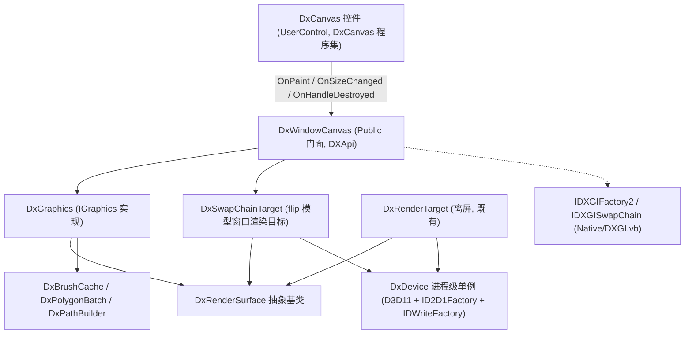

## 产品概述

在已有图形项目基础上，为 Windows 桌面窗体程序提供一个可复用的「绘图画布」控件，把绘制工作交给项目已有的图形后端执行，从而获得硬件加速的 2D 绘图能力。控件本身不承载可视化设计内容，而是一个可供其他窗体放置、通过代码驱动绘制的绘图面板。

## 核心功能

- **可嵌入的绘图控件**：一个可拖放到任意窗体上的画布控件，随窗体尺寸变化自动适配绘图区域大小，窗口缩放后内容按新尺寸重绘。
- **两种绘制入口**：
- 事件回调方式：控件在需要重绘时抛出绘制事件，使用者在事件中直接绘制，贴近窗体「重绘事件」的既有习惯；
- 主动取用方式：使用者通过控件公开的绘图对象属性直接发起绘制，再请求控件刷新。
- **按需重绘**：不内置动画循环与帧率统计；只在控件请求刷新、尺寸变化时重绘一次，使用者自行决定何时触发。
- **绘制内容与已有绘图对象完全一致**：复用项目现有的绘图模型（画笔、画刷、字体、路径、颜色），支持多边形、矩形、椭圆、线、路径、图片、文本、变换、裁剪、清屏等既有绘图能力。
- **自动清屏与背景色**：每帧开始时可按设置以指定背景色清空画布，避免上一帧残留；可关闭该行为由使用者自行控制。
- **垂直同步开关**：可选择绘制提交时是否等待显示器刷新，兼顾画面稳定与响应速度。
- **当前帧导出**：支持把画布当前内容保存为图片文件，便于查看与留档。
- **设备信息可读**：控件对外暴露当前使用图形设备的一段可读描述，便于排查是硬件设备还是软件回退设备。
- **示例窗体**：提供一个可直接运行的示例窗口承载该控件，在其中绘制数量庞大的随机多边形（数万个），并在界面上显示设备描述、多边形数量与本帧绘制耗时，直观展示大量多边形场景下的绘制效率。

## 技术栈选择

- 语言/运行时：VB.NET，`net10.0-windows`（沿用现有项目配置，SDK 10.0.401 已具备）
- 界面框架：Windows Forms（`src\DxCanvas\DxCanvas.vbproj` 已设 `UseWindowsForms=true`，保持 `OutputType=Library`）
- 图形后端：沿用 `src\DXApi` 已实现的纯托管 P/Invoke / `ComImport` 互操作层（Direct2D + Direct3D11 + DXGI + DirectWrite），本次新增 **DXGI flip 模型交换链**（`CreateSwapChainForHwnd`）路径
- 宿主方式：控件把自身窗口句柄交给交换链，后台缓冲的 DXGI 表面作为 Direct2D 渲染目标，绘制完成后 `Present` 上屏
- 验证环境：`dotnet build` / `dotnet run`（win32 + PowerShell）

## 实现方式

### 总体策略

在 `DXApi` 程序集内部完成「窗口渲染目标」的实现与渲染目标的抽象化，再在其上暴露一个 `Public` 门面供控件所在程序集使用；`DxCanvas.vb` 只负责 WinForms 生命周期与事件转发，保持为轻量控件。

关键决策与理由：

1. **沿用「展平 vtable + 前缀声明」的 COM 声明约定**。上一轮已确认：用 `Inherits` 表达接口继承会导致 vtable 偏移错误并崩溃，最终必须把基类方法按正确槽位直接写进派生接口。本次新增的 `IDXGIFactory2` / `IDXGISwapChain` 必须沿用该方式，并且**只声明到实际需要调用的槽位为止**（`CreateSwapChainForHwnd` = `IDXGIFactory2` 槽 15；`Present` / `GetBuffer` / `ResizeBuffers` = `IDXGISwapChain` 槽 8 / 9 / 13），未调用到的后续槽位不声明，从而把 vtable 声明出错的面收敛到最小。

2. **flip 模型（`DXGI_SWAP_EFFECT.FLIP_DISCARD`）+ `BufferCount=2` + `DXGI_FORMAT.B8G8R8A8_UNORM`**。相比 bitblt 模型，flip 模型在现代 Windows 上呈现更高效，且能与 Direct2D 的 BGRA 表面直接对接。代价是 **`Present` 之后后台缓冲内容未定义**，因此每帧必须 `Clear`（由控件的 `AutoClear`/`BackgroundColor` 保证）。

3. **抽象出 `DxRenderSurface` 基类，保持 `DxGraphics` 约 50 处 `renderTarget.Target` 调用零改动**。把现有离屏目标 `DxRenderTarget` 改为该基类的派生（行为完全不变），新增 `DxSwapChainTarget` 派生。`DxGraphics` 只把字段类型由 `DxRenderTarget` 改为 `DxRenderSurface`，绘图实现主体不动。同时把 `brushes` / `batch` 由 `ReadOnly` 改为可重建（`Resize` 与设备丢失重建渲染目标后必须重新构造它们）。

4. **Public 门面 `DxWindowCanvas`**。`DxDevice` / `DxRenderSurface` 均为 `Friend`，控件所在程序集不可见，故在 `DXApi` 内新增一个 `Public Class DxWindowCanvas`，公开面只使用公共类型（`DxGraphics`、`Integer`、`Boolean`、`String`、`Byte()`），负责交换链目标与 `DxGraphics` 的装配、帧边界、尺寸变更、设备丢失标记。

5. **不引入动画定时器**（用户已确认按需重绘），`Present` 在 UI 线程最多阻塞约一个屏幕刷新周期，可接受；仍暴露 `VSync` 开关便于关闭。

6. **示例放在 `test` 项目**（用户已确认），`DxCanvas` 保持类库不引入可执行入口。

### 性能与可靠性

- 性能关键仍是「按颜色缓存画刷 + 把同画刷的连续多边形合并成单个几何体一次提交」（`DxBrushCache` / `DxPolygonBatch` 现有机制），本次不新增每帧资源创建。
- 尺寸变化走 `ResizeBuffers(0, w, h, UNKNOWN, 0)` 后重新 `GetBuffer(0)` 并重建 Direct2D 目标，释放旧目标与表面指针，避免泄漏；宽或高为 0 时直接跳过。
- 交换链创建时 `DXGI_SWAP_CHAIN_DESC1` 的字段顺序/类型必须与 `dxgi1_2.h` 严格一致（48 字节布局），否则会出现难以定位的崩溃。
- 提交失败（`DXGI_ERROR_DEVICE_REMOVED` / `DEVICE_RESET` / `D2DERR_RECREATE_TARGET`）时置 `NeedsRecreate` 标记，由控件在下次重绘前重建交换链；若为设备本身丢失（`DxDevice` 为进程级单例、不可重建），控件停止渲染并给出明确异常信息，避免静默崩溃。
- 无显卡/远程会话时 `DxDevice` 已自动回退 WARP，flip 模型交换链在 WARP 下同样可用。
- Alpha 模式不确定性：窗口后台缓冲通常应使用 `D2D1_ALPHA_MODE.IGNORE`；若返回 `D2DERR_UNSUPPORTED_PIXEL_FORMAT`，回退尝试 `PREMULTIPLIED`，实现后以真实运行结果定稿。

## 架构设计



数据流：控件收到重绘 -> `DxWindowCanvas.BeginDraw()` 开启帧 -> 抛出绘制事件或使用者主动绘制 -> 绘制指令直接提交到后台缓冲的 Direct2D 目标 -> `DxWindowCanvas.EndDraw()`（先刷出多边形批次，再结束 Direct2D 帧并 `Present` 上屏）。

## 执行说明（重要约束）

- **COM 声明**：新增接口一律「展平 + 前缀声明」，不要使用 `Inherits`；未声明的槽位不实现。`CreateSwapChainForHwnd` 的 `pDevice` 参数声明为 `IntPtr`，调用处用 `Marshal.GetIUnknownForObject(device.Device)` 取指针并在 `Finally` 中 `Marshal.Release`（与现有 `ComQuery` 的写法保持一致）。
- **控件文件拆分**：`DxCanvas.vb` 是 `Partial Class DxCanvas`，`Inherits System.Windows.Forms.UserControl` 已在 `DxCanvas.Designer.vb` 中声明，主文件**不得重复写 `Inherits`**；`Dispose(disposing)` 也已在 Designer 部分类中重写，主文件**不得再重写**，释放逻辑统一放在 `OnHandleDestroyed` 中。
- **背景与闪烁**：构造函数中 `SetStyle(ControlStyles.UserPaint Or ControlStyles.AllPaintingInWmPaint Or ControlStyles.Opaque, True)`；`OnPaintBackground` 空实现；**不要**开启 `OptimizedDoubleBuffer`。
- **回归保护**：改造 `DxRenderTarget` / `DxGraphics` 后必须重跑既有离屏路径（`--dx` 的 Skia 对比基准）确认无回归；不要改动工作区外 `G:\GCModeller` 下任何文件。
- **`test.vbproj` 开启 WinForms 的影响面**：新增 `<UseWindowsForms>true</UseWindowsForms>` 后 `System.Drawing` 走 Windows Desktop 框架，现有代码已用别名 `Graphics = Microsoft.VisualBasic.Drawing.Graphics` 规避歧义，保持不动即可。
- **日志**：不新增日志框架；失败路径用抛异常 + 控件对外暴露的设备描述（`DeviceDescription`）表达，避免在渲染热路径打印。

## 目录结构

```
g:/Microsoft.VisualBasic.Drawing/
├── src/
│   ├── DXApi/
│   │   ├── Native/
│   │   │   ├── DXGI.vb                # [MODIFY] 新增交换链互操作声明：CreateDXGIFactory1 P/Invoke；IDXGIFactory2（展平前缀至槽 15 CreateSwapChainForHwnd）；IDXGISwapChain（展平前缀至槽 13 ResizeBuffers，含槽 8 Present / 槽 9 GetBuffer）；DXGI_SWAP_CHAIN_DESC1（宽高、格式、Stereo、SampleDesc、BufferUsage、BufferCount、Scaling、SwapEffect、AlphaMode、Flags，48 字节严格布局）、DXGI_SWAP_CHAIN_FULLSCREEN_DESC、DXGI_RATIONAL；枚举 DXGI_SWAP_EFFECT(FLIP_DISCARD=4)、DXGI_SCALING(STRETCH=0)、DXGI_USAGE(RENDER_TARGET_OUTPUT=0x20)、DXGI_ALPHA_MODE、DXGI_PRESENT、DXGI_SWAP_CHAIN_FLAG。所有新接口均不得使用 Inherits
│   │   │   └── ComBase.vb             # [MODIFY] DxConstants 增加 IID_IDXGIFactory2(50c83a1c-e072-4c48-87b0-3630fa36a6d0)、IID_IDXGISwapChain(310d36a0-d02c-4a0a-aa04-6a9d23b8886a)，以及 DXGI_ERROR_DEVICE_REMOVED(0x887A0005)、DXGI_ERROR_DEVICE_RESET(0x887A000C)、DXGI_ERROR_WAS_STILL_DRAWING(0x887A000B)、D2DERR_UNSUPPORTED_PIXEL_FORMAT(0x8899000B)
│   │   ├── DxRenderSurface.vb         # [NEW] Friend MustInherit Class DxRenderSurface : Implements IDisposable。统一渲染目标抽象：Width/Height/Device 属性；MustOverride 的 Target(ID2D1RenderTarget)、BeginDraw/EndDraw、Resize(width,height)；Overridable 的 Flush()、ReadPixels()、SupportsReadback（默认 False）；VSync 属性；Dispose 模板方法与 Finalize。DxGraphics 与两种渲染目标都依赖这一契约
│   │   ├── DxRenderTarget.vb          # [MODIFY] 改为 Inherits DxRenderSurface（离屏：D3D11 纹理 + staging 回读），行为与现有实现完全一致；把现有 BeginDraw/EndDraw 提升为 Overrides；SupportsReadback 返回 True；Resize 重新创建纹理/staging/目标并重建 brushes/batch 所需的尺寸。禁止改变既有对外行为
│   │   ├── DxSwapChainTarget.vb       # [NEW] Friend Class DxSwapChainTarget : Inherits DxRenderSurface。flip 模型窗口渲染目标：持有 IDXGIFactory2 与 IDXGISwapChain 字段；构造 (device, hwnd, width, height, dpi, vsync) 中 CreateDXGIFactory1 -> 填 DXGI_SWAP_CHAIN_DESC1(B8G8R8A8_UNORM/BufferCount=2/FLIP_DISCARD/RENDER_TARGET_OUTPUT/STRETCH) -> CreateSwapChainForHwnd -> GetBuffer(0, IID_IDXGISurface) -> CreateDxgiSurfaceRenderTarget（先 IGNORE，失败回退 PREMULTIPLIED）-> BeginDraw()。EndDraw：Direct2D EndDraw 后 swapChain.Present(vsync?1:0, 0)；错误码映射为 NeedsRecreate。Resize：EndDraw -> 释放目标与表面 -> ResizeBuffers(0,w,h,UNKNOWN,0) -> 重新 GetBuffer 与建目标。ReadPixels：GetBuffer(0, IID_ID3D11Texture2D) -> CopyResource 到 staging -> Map/Unmap（供导出当前帧）。Dispose 释放全部 COM 引用
│   │   ├── DxWindowCanvas.vb          # [NEW] Public Class DxWindowCanvas : Implements IDisposable。控件可用的公共门面：New(hwnd, width, height, dpi, vsync)；ReadOnly Graphics As DxGraphics；ReadOnly DeviceDescription/Width/Height As Integer；Property VSync；Sub Resize(width,height)（同步更新 DxGraphics 的尺寸）；Sub BeginDraw()/Sub EndDraw()（EndDraw 内含批次刷出与 Present）；Function ReadPixels() As Byte()；ReadOnly NeedsRecreate As Boolean；ReadOnly IsDeviceLost As Boolean；Dispose
│   │   └── DxGraphics.vb              # [MODIFY] 字段 renderTarget 类型改为 DxRenderSurface（约 50 处 renderTarget.Target 调用保持不动）；brushes/batch 去掉 ReadOnly 并新增 Private Sub RebuildTargetResources()；新增 Friend Sub New(surface As DxRenderSurface, fill As Color, dpi As Integer)；新增 Public Sub BeginFrame()（重置 transform 与裁剪栈、BeginDraw）与 Public Sub EndFrame()（batch.Flush + EndDraw）；GetRasterImage/Save 在 SupportsReadback=False 时抛出语义清晰的 NotSupportedException；保留既有两个 Public 构造函数（离屏路径）不变
│   ├── DxCanvas/
│   │   ├── DxCanvas.vb                # [MODIFY] 实现控件：Partial Class DxCanvas（不写 Inherits）。构造中 SetStyle(UserPaint|AllPaintingInWmPaint|Opaque)；OnPaintBackground 空实现；OnHandleCreated 用 Handle/ClientSize/DeviceDpi 建 DxWindowCanvas；OnHandleDestroyed 释放并置空（并处理 NeedsRecreate 的重建）；OnSizeChanged -> Resize + Invalidate（尺寸为 0 跳过）；OnPaint -> BeginDraw / RaiseEvent Render / EndDraw（Try/Finally）。公开成员：Event Render(sender, e As DxRenderEventArgs)、ReadOnly Graphics As DxGraphics、ReadOnly DeviceDescription As String、Property VSync、Property AutoClear(默认 True)、Property BackgroundColor、Function SaveImage(file, Optional format) As Boolean
│   │   └── DxRenderEventArgs.vb       # [NEW] Public Class DxRenderEventArgs : Inherits EventArgs，暴露 ReadOnly Property Graphics As IGraphics（Microsoft.VisualBasic.Imaging.IGraphics），以及若干只读帧信息（画布尺寸）。使示例与外部代码可直接用既有绘图抽象编写绘制逻辑
│   └── Microsoft.VisualBasic.Drawing/test/
│       ├── test.vbproj                # [MODIFY] 新增 <UseWindowsForms>true</UseWindowsForms> 与 <ProjectReference Include="..\..\DxCanvas\DxCanvas.vbproj" />。保持 OutputType=Exe
│       ├── DxCanvasDemo.vb            # [NEW] 示例：Module DxCanvasDemo + Friend Class DxCanvasDemoForm : Inherits Form。控件 Dock=Fill 承载，底部状态标签显示设备描述、多边形数量、本帧绘制耗时（Stopwatch）、控件尺寸；提供「重绘」与「保存图片」按钮；Render 事件中绘制数万个随机多边形（多边形生成逻辑与 DxBenchmark.vb 保持一致，可复用则复用）。另提供 Sub RunSmoke()：开窗后由 System.Windows.Forms.Timer 定时自动关闭，退出时打印设备描述、多边形数量与平均帧耗时
│       └── Program.vb                 # [MODIFY] 为 Sub Main 增加 <STAThreadAttribute>；新增 --dxcanvas（Application.EnableVisualStyles + Application.Run(DxCanvasDemoForm)）与 --dxcanvas-smoke（DxCanvasDemo.RunSmoke()）分支，插在现有 --dxsmoke/--dx 分支之后；不改变其余既有流程
```

## 关键代码结构

```
' DXApi/DxRenderSurface.vb —— 统一渲染目标契约，两种渲染目标（离屏 / 交换链窗口）都实现它，
' DxGraphics 仅依赖该抽象，从而复用全部既有绘图实现
Friend MustInherit Class DxRenderSurface : Implements IDisposable

    Friend ReadOnly Property Width As Integer
    Friend ReadOnly Property Height As Integer
    Friend ReadOnly Property Device As DxDevice
    Friend MustOverride ReadOnly Property Target As ID2D1RenderTarget

    ''' <summary>窗口交换链目标的后台缓冲在 flip 模型下不能直接读取，此时为 False</summary>
    Friend Overridable ReadOnly Property SupportsReadback As Boolean
        Get
            Return False
        End Get
    End Property

    Friend Property VSync As Boolean = True

    Friend MustOverride Sub BeginDraw()
    Friend MustOverride Sub EndDraw()
    Friend MustOverride Sub Resize(width As Integer, height As Integer)
    Friend Overridable Sub Flush()
    Friend Overridable Function ReadPixels() As Byte()
End Class
```

```
' DXApi/Native/DXGI.vb —— 交换链声明要点（必须展平 vtable，且只声明到需要调用的槽位）
<StructLayout(LayoutKind.Sequential)>
Friend Structure DXGI_SWAP_CHAIN_DESC1
    Public Width As UInteger          ' 0
    Public Height As UInteger         ' 4
    Public Format As Integer          ' 8   DXGI_FORMAT.B8G8R8A8_UNORM
    Public Stereo As Integer          ' 12
    Public SampleDesc As DXGI_SAMPLE_DESC   ' 16  {Count = 1, Quality = 0}
    Public BufferUsage As UInteger    ' 24  DXGI_USAGE.RENDER_TARGET_OUTPUT
    Public BufferCount As UInteger    ' 28  2
    Public Scaling As Integer         ' 32  DXGI_SCALING.STRETCH
    Public SwapEffect As Integer      ' 36  DXGI_SWAP_EFFECT.FLIP_DISCARD
    Public AlphaMode As Integer       ' 40  DXGI_ALPHA_MODE.UNSPECIFIED
    Public Flags As UInteger          ' 44  0
End Structure

<ComImport, Guid("50c83a1c-e072-4c48-87b0-3630fa36a6d0"),
 InterfaceType(ComInterfaceType.InterfaceIsIUnknown)>
Friend Interface IDXGIFactory2
    ' 槽 3~14：IDXGIObject / IDXGIFactory / IDXGIFactory1 的方法占位（按顺序声明，无需调用）
    ' 槽 15：唯一需要调用的方法
    <PreserveSig> Function CreateSwapChainForHwnd(
        pDevice As IntPtr, hwnd As IntPtr,
        ByRef desc As DXGI_SWAP_CHAIN_DESC1,
        fullscreenDesc As IntPtr, restrictToOutput As IntPtr,
        <Out> ByRef swapChain As IntPtr) As Integer
End Interface

<ComImport, Guid("310d36a0-d02c-4a0a-aa04-6a9d23b8886a"),
 InterfaceType(ComInterfaceType.InterfaceIsIUnknown)>
Friend Interface IDXGISwapChain
    ' 槽 3~7：IDXGIObject / IDXGIDeviceSubObject 的方法占位
    <PreserveSig> Function Present(syncInterval As UInteger, flags As UInteger) As Integer          ' 槽 8
    <PreserveSig> Function GetBuffer(buffer As UInteger, ByRef riid As Guid,
                                     <Out> ByRef surface As IntPtr) As Integer                       ' 槽 9
    ' 槽 10~12：占位
    <PreserveSig> Function ResizeBuffers(bufferCount As UInteger, width As UInteger, height As UInteger,
                                         newFormat As Integer, flags As UInteger) As Integer         ' 槽 13
End Interface
```

## Agent Extensions

### Skill

- **lsp-code-analysis**
- Purpose：在把 `DxRenderTarget` 抽象为 `DxRenderSurface`、以及把 `DxGraphics.renderTarget` 字段类型改为基础类型的改造过程中，用语义分析能力找出字段/类型的全部引用与实现点，确认约 50 处 `renderTarget.Target` 调用与 `brushes`/`batch` 的构造点全部覆盖，并核对 `DxCanvas` 控件成员是否与 `DxCanvas.Designer.vb` 中已声明的 `Inherits`、`Dispose`、`components` 冲突。
- Expected outcome：产出准确的调用点/实现点清单与冲突检查结论，保证改造不遗漏、不重复声明，避免编译错误与运行期空引用。

### SubAgent

- **code-explorer**
- Purpose：核实 `src\DXApi` 各文件的真实签名与槽位布局（`ID2D1Factory`、`ID2D1RenderTarget`、`DxBrushCache`/`DxPolygonBatch` 构造签名、`ID3D11Texture2D`/`ID3D11DeviceContext` 现有方法），并查明 `test\DxBenchmark.vb` 中随机多边形生成的既有辅助函数，以便示例窗体直接复用而不是另写一套。
- Expected outcome：得到可直接照抄的类型签名清单与该复用的示例绘制辅助函数，降低 COM 声明出错与被测场景不一致的风险。