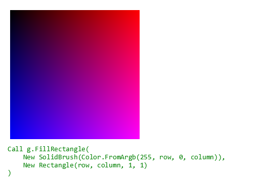

# Microsoft.VisualBasic.Drawing

A replacement of the ``System.Drawing`` on linux environment for help migrant sciBASIC.NET based application from .net 6 to .net 8 and higher version of .net.

this project provides the driver code for access the graphics drawing on different os based on the skia sharp project
from the .net 8.0, the gdi+ and pdf graphics drawing code was removed from scibasic.net framework, only works for the graphics math algorithm.

#### Note about skiasharp save bitmap

Currently, the bitmap file is not supported in skiasharp, the ``SKData`` is always nothing of you try to get bitmap encode data, example as:

```vbnet
' encoded is null always
' if we try to encode skbitmap as bitmap file
Using encoded = SKBitmap.Encode(SKEncodedImageFormat.Bmp, 100)
    Using stream = System.IO.File.OpenWrite("hello_world.png")
        encoded.SaveTo(stream)
    End Using
End Using
```

The [BMP#](https://github.com/dsoronda/bmp-sharp) project was applied to resolve this problem.

#### supports for tiff for scientific images

The [ntiff](https://github.com/digimarc-corp/ntiff) project is used for add supports for the scientific images in this framework.

### Graphics Demo

```vbnet
Private Function Rendering(Of T As SkiaGraphics)(g As T) As T
    Dim offset As Integer = 20

    For row As Integer = offset To offset + 255
        For column As Integer = offset To offset + 255
            Call g.FillRectangle(
                New SolidBrush(Color.FromArgb(255, row - offset, 0, column - offset)),
                New Rectangle(row, column, 1, 1)
            )
        Next
    Next

    Dim font As New Font(FontFace.Consolas, 14)
    Dim h = g.MeasureString("A", font)
    Dim y = 300

    Call g.DrawString("Call g.FillRectangle(", font, Brushes.Green, New PointF(15, y))
    Call g.DrawString("    New SolidBrush(Color.FromArgb(255, row, 0, column)),", font, Brushes.Green, New PointF(15, y + h.Height * 1.75))
    Call g.DrawString("    New Rectangle(row, column, 1, 1)", font, Brushes.Green, New PointF(15, y + h.Height * 3.5))
    Call g.DrawString(")", font, Brushes.Green, New PointF(15, y + h.Height * 5.25))

    Return g
End Function
```



```vbnet
Call Rendering(New Graphics(512, 365, "#ffffff")).Save("./RedBlueArgb32GradientWithAlpha.bmp", ImageFormats.Bmp)
Call Rendering(New Graphics(512, 365, "#ffffff")).Save("./RedBlueArgb32GradientWithAlpha.webp", ImageFormats.Webp)
Call Rendering(New Graphics(512, 365, "#ffffff")).Save("./RedBlueArgb32GradientWithAlpha.png")
Call Rendering(New SvgGraphics(512, 365)).Save("./RedBlueArgb32GradientWithAlpha.svg")
Call Rendering(New PdfGraphics(512, 365)).Save("./RedBlueArgb32GradientWithAlpha.pdf")
```


## ANSI Image Viewer 

A vb.net CLI tool takes in an image file, and using ANSI escape sequences, outputs a low-fidelity preview of the image in the terminal.


```vbnet
Imports Microsoft.VisualBasic.CommandLine
Imports Microsoft.VisualBasic.Drawing

Module Program

    Sub New()
        Call Microsoft.VisualBasic.Imaging.Driver.Register(Function(s) SkiaImage.FromFile(s))
    End Sub

    Public Function Main() As Integer
        Return GetType(Program).RunCLI(App.CommandLine, executeFile:=AddressOf PreviewFile, executeEmpty:=AddressOf Help)
    End Function

    Private Function Help() As Integer
        Call Console.WriteLine("Usage: preview <image-file> [--width <display_width, should less than the console width>] [--true-color|--256-color]")
        Return 0
    End Function

    Private Function PreviewFile(file As String, args As CommandLine) As Integer
        Dim terminalWidth As Integer = args("--width") Or (Console.WindowWidth - 1)
        Dim trueColor As Boolean = args("--true-color")
        Dim c256Color As Boolean = args("--256-color")

        If trueColor Then
            ANSI.useTrueColor = True
        End If
        If c256Color Then
            ANSI.useTrueColor = False
        End If

        Dim preview As String = ANSI.GenerateImagePreview(file, terminalWidth)
        Call Console.Write(preview)
        Return 0
    End Function
End Module

```