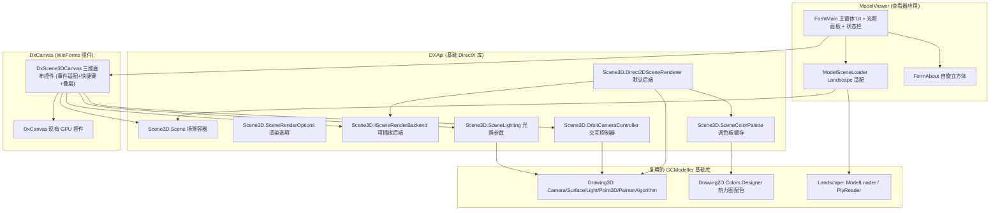

## 产品概述

为现有的 DirectX 基础库补齐可复用的「交互式三维场景渲染管线」，并在此基础上构建一个与现有 CPU 版三维模型查看器功能一致的 DirectX 加速三维模型查看器。

## 核心功能

**基础库可复用能力（供其他正式项目复用）**

- 三维场景容器：以「面」集合与「点云」集合承载模型数据，自动计算包围球中心与半径、地面高度，并完成模型居中与视角自动适配。
- 三种渲染呈现方式：表面填充（带光照）、三角线框、点云（按强度热力图着色）。
- 地面网格、背景色、光照（光源方位/仰角/环境光强度/光照亮度/灯光颜色）与热力图调色板。
- 与界面无关的相机交互控制器：鼠标左键拖拽轨道旋转、右键拖拽平移、滚轮缩放、重置视角，内部维护旋转/平移/缩放状态。
- 渲染后端可插拔：当前基于 DirectX 二维 GPU 画布实现，接口预留将来切换到真三维渲染管线。

**可复用三维画布组件**

- 一个可直接放到窗体上的三维绘图画布控件，内部接管鼠标与键盘输入并自动重绘。
- 鼠标：左键拖拽旋转、右键拖拽平移、滚轮缩放。
- 键盘快捷键：重置视角、切换渲染模式、开关地面、截图、刷新。
- 对外公开渲染模式、配色、点云点尺寸、自带颜色、地面与背景色、全部光照参数等可绑定属性，并暴露设备信息与错误信息。

**DirectX 加速三维模型查看器**

- 打开七种三维模型格式（stl、obj、gltf、glb、dae、3ds、3mf）与 PLY 点云；打开失败给出提示。
- 切换三种渲染模式；选择十一种热力图配色；设置点云点尺寸；切换点云自带颜色。
- 右侧光照参数面板：光源方位、光源仰角、环境光、光照亮度四个滑块，灯光颜色选择与一键重置光照。
- 显示/隐藏地面网格；设置背景色；重置视角。
- 状态栏显示：文件名、渲染模式、面数/点数、旋转角度、视距、环境光与亮度。
- 调试信息叠加：相机参数与实时帧率。
- 截图导出当前画面；显示当前使用的 GPU 设备信息。
- 关于对话框：自动旋转的彩色立方体。

## 视觉与交互效果

桌面窗口自上而下为菜单栏、工具栏、状态栏，右侧为固定宽度的光照参数面板，中央为占满剩余空间的 GPU 绘图画布。画布内以带光照的实体面绘制三维模型，模型下方为灰色方形网格地面，空白处为可自定义的背景色。鼠标左键拖拽时模型随视线实时旋转，右键拖拽整体平移，滚轮改变远近；切换到线框模式仅显示半透明深色三角网格，切换到点云模式显示按强度由热力图着色的方形点，点云可改用文件自带颜色。开启调试信息时，画布左上角叠加半透明黑底面板显示相机旋转角、视距、视场、屏幕尺寸、光色、光向与环境光以及实时帧率。

## 技栈选型

- 语言/平台：VB.NET，SDK 风格工程（`Microsoft.NET.Sdk`），`net10.0-windows`（沿用各工程现状，不修改 TFM）。
- 界面：WinForms（`UseWindowsForms`），沿用现有 `DxCanvas` 控件与 `My` 应用模型。
- 渲染：复用工作区已有的 `DxGraphics`（`Inherits IGraphics` 的 Direct2D/D3D11/DXGI 纯托管后端）作为 GPU 画布；复用 GCModeller 的 `Microsoft.VisualBasic.Imaging.Drawing3D`（`Camera`/`Surface`/`Light`/`PainterAlgorithm`/`Point3D`/`Transformation`）作为三维数学与光照，复用 `Microsoft.VisualBasic.Imaging.Drawing2D.Colors.Designer.GetColors` 作为热力图调色板。
- 模型加载：复用 `Microsoft.VisualBasic.Imaging.Landscape`（`Data.ModelLoader.LoadModel`、`Data.Surface.CreateObject`、`Ply.PlyReader.ReadFile`）。
- 不改动 GCModeller 侧任何工程（imaging.NET5、Landscape、tutorials/ModelViewer 均只读复用）。

## 实现方案

**总体策略：源码驱动对齐 + 分层抽象 + 预留后端插拔。**

1. **渲染方案（方案 A）**：不新增 D3D11 三维管线，而是把 CPU 版「旋转 → 伪透视投影 → 画家算法排序 → 逐面填充」的成像结果改为提交给 `DxGraphics`（Direct2D GPU 画布）绘制。核心调用链为：`camera.Rotate(surfaces)`（跨平台，`#If WINDOWS` 之外）→ 逐面 `camera.Project(...)` + `camera.Lighting(...)` → 按面平均 Z 降序排序 → `canvas.FillPolygon(brush, points)`。这与 CPU 版 `Camera.Draw(Graphics, ...)` 完全等价，从而保证成像一致。
2. **不直接复用 `Camera.Draw`**：该重载位于 `#If WINDOWS` 内且只接受 `System.Drawing.Graphics`。`PainterAlgorithm.SurfacePainter(IGraphics, ...)`/`BufferPainting(IGraphics, ...)` 为重载在 `#If WINDOWS` 之外，可直接用于 `DxGraphics`；但为避免 `PainterBuffer` 每帧为每个面 `New SolidBrush` 且不释放的开销，默认后端改为「复用 `Camera.Lighting` 与 `PainterAlgorithm.OrderProvider` 的等价实现 + 自有画刷缓存」，保证视觉一致同时消除每帧分配。
3. **抽象落位（用户已确认）**：可复用逻辑放入 `DXApi` 基础库，新增命名空间 `Microsoft.VisualBasic.Drawing.DirectX.Scene3D`。为此 DXApi 需**新增 `imaging.NET5.vbproj` 的 ProjectReference**（当前未引用，因此 `Drawing3D` 类型与 `Designer.GetColors` 不可用）；这会使其 nupkg 带上 imaging 依赖，属预期。
4. **交互抽象（用户已确认）**：基础库提供与 UI 完全无关的 `OrbitCameraController`（入参为枚举化的鼠标按键与像素增量、滚轮增量，不引用 `System.Windows.Forms`），维护旋转角/平移偏移/视距状态；`DxCanvas` 工程新增一个 WinForms 三维画布控件负责事件适配与重绘。
5. **渲染后端插拔预埋（用户已确认）**：定义 `ISceneRenderBackend`，每帧接收 `IGraphics` 画布、场景、相机与渲染选项；默认实现为二维后端，将来可新增真三维后端并在运行时切换。
6. **查看器功能对齐（用户已确认）**：完全对齐 CPU 版（三模式、七格式 + PLY、十一种配色、光照面板、地面网格、背景色、重置视角、状态栏、FPS 叠层），并新增键盘快捷键、截图导出、GPU 设备信息显示。

**关键取舍**

- 保留伪透视投影 `factor = fov / (viewDistance + z)` 与 `FitView` 中 `FieldOfView = 256 * 8`，逐字复刻以保证与 CPU 版成像一致；不引入标准透视矩阵。
- 平移继续作用于 `Camera.Offset`（投影后叠加的屏幕像素偏移），与 CPU 版语义一致。
- 继续使用画家算法（无 Z-Buffer），地面网格先画、依靠模型不透明面遮挡，与 CPU 版一致。
- `DxCanvas.AutoClear` 设为 `False`，由渲染后端自行 `Clear(BackgroundColor)`，以支持运行时改背景色。

**性能与可靠性**

- 面绘制量级为「模型面数」次多边形提交；`DxPolygonBatch` 会把同色多边形合并为单路径一次 `FillGeometry`，配合画刷缓存可显著减少提交次数。画布的 `DxBrushCache` 复用画刷与文本格式。
- 点云为逐点小方块，是主要瓶颈：按颜色分组批量提交，并对「相机/场景未变化」的情况复用上一帧的投影结果（脏标记 + 缓存），避免每帧重算 `Parallel.For` 投影。
- 仅在交互或状态变化时 `Invalidate()`，不引入常驻动画循环（与 CPU 版一致），无谓重绘为 0 帧。
- 三维场景为空时渲染后端跳过全部几何计算，仅清屏。

## 实施要点（Execution Details）

- **不可直接调用 `Camera.Draw(Graphics,...)`**（Windows 限定且签名不匹配）；必须走 `Rotate` + 投影 + 排序 + `FillPolygon`。
- **`PainterBuffer` 只投影不旋转**：Surface 模式必须先 `camera.Rotate(surfaces)`，否则模型不随鼠标旋转。
- **`illumination=False` 会强制 `DirectCast(s.brush, SolidBrush)`**：Surface 模式必须走光照分支；Mesh/PointCloud 模式自建多边形，不复用该分支。
- **视角参数单位为度**（`Camera.AngleX/Y/Z` 与 `Point3D.RotateX/Y/Z` 均为度）；`Math3D.Transformation.RotateX/Y/Z(origin, angle)` 为弧度，本任务不使用。
- **旋转不 clamp**（与 CPU 版一致）；缩放下限 `ViewDistance >= 1.0`。
- **`SaveImage`/`CaptureFrame` 会强制同步重绘并再次触发 `Render`，且在 `Render` 内调用会抛 `InvalidOperationException`**：截图入口必须在 `Render` 之外（菜单/快捷键处理里）触发。
- **`DxCanvas` 已自行 `BeginDraw/EndDraw`**：宿主只需在 `Render` 事件内绘制；`DxRenderEventArgs.Graphics` 为 `IGraphics`。
- **DXApi/DxCanvas 已开启 NuGet 打包**：新增 ProjectReference 后需确认打包元数据（README/Icon）与既有配置不冲突；DxCanvas README 需补充新控件说明。
- **不要修改 GCModeller 仓库任何文件**，全部新增代码落在工作区 `DXApi`、`DxCanvas`、`ModelViewer` 三个工程。
- 代码风格沿用工程现状：显式 `Public`、XML 文档注释（英文）、`OptionStrict`、命名空间与 `RootNamespace` 对齐。

## 架构设计



**模块划分**

- `DXApi.Scene3D`：场景数据（`Scene`/`PointCloudPoint`）、渲染描述（`SceneRenderMode`/`SceneRenderOptions`/`SceneColorPalette`）、后端契约（`ISceneRenderBackend` + 默认 `Direct2DSceneRenderer`）、交互与光照（`OrbitCameraController`/`SceneLighting`）。全部与 UI 无关。
- `DxCanvas`：新增 `DxScene3DCanvas : Inherits DxCanvas`，把 WinForms 鼠标/键盘事件翻译为控制器入参，持有场景与渲染后端，在 `Render` 事件内驱动后端绘制，并负责调试叠层文本与对外属性/事件。
- `ModelViewer`：`ModelSceneLoader` 把 Landscape 的 `SceneModel`/`PointCloud` 映射为 `Scene3D.Scene`；`FormMain` 组织 UI 与状态同步；`FormAbout` 复用 `Cube` 模型。

**数据流**
打开文件 → `ModelSceneLoader` 加载并居中 → 写入 `Scene` → `DxScene3DCanvas.Scene` 赋值 → `FitView` 适配视角 → 鼠标/键盘事件 → 控制器更新相机状态 → `Invalidate()` → `OnPaint` 开帧 → 渲染后端读取相机+场景+选项，投影排序并提交 `FillPolygon`/`DrawPolygon`/`FillRectangle` → 叠加调试文本 → 结束帧并呈现在窗口。

## 目录结构

```
g:/Microsoft.VisualBasic.Drawing/src/
├── DXApi/
│   ├── DXApi.vbproj                          # [MODIFY] 新增 imaging.NET5.vbproj 的 ProjectReference（Drawing3D 与热力图配色所需）
│   ├── README.md                             # [MODIFY] 补充 Scene3D 场景管线能力与用法说明
│   └── Scene3D/
│       ├── Scene.vb                          # [NEW] 三维场景容器。持有面集合（Drawing3D.Surface()）与点云集合；提供 LoadSurfaces/LoadPointCloud（自动以质心居中）、Center/Radius/GroundZ/IntensityRange、HasData/SurfaceCount/PointCount、FitView(camera, screenSize)（复刻 256*8 与 0.4*minDim 公式）。
│       ├── PointCloudPoint.vb                # [NEW] 与 UI/格式无关的点云点结构（X/Y/Z Double、Intensity Double、ColorHex String），供任意点云数据源映射。
│       ├── SceneRenderMode.vb                # [NEW] 渲染模式枚举：Surface / Mesh / PointCloud。
│       ├── SceneRenderOptions.vb             # [NEW] 渲染选项：Mode、ColorScheme、PointSize、PointAlpha、UseEmbeddedColor、ShowGround、GroundColor、BackgroundColor。
│       ├── ISceneRenderBackend.vb            # [NEW] 可插拔渲染后端契约（预留真三维扩展点）+ 后端注册/切换载体（默认后端名与实例）。
│       ├── Direct2DSceneRenderer.vb          # [NEW] 默认后端：实现 ISceneRenderBackend，基于 IGraphics 完成清屏、地面网格、表面填充（光照+画家算法排序）、线框、点云绘制；内部使用画刷缓存与 OrderProvider 等价排序，避免每帧新建 SolidBrush。
│       ├── SceneColorPalette.vb              # [NEW] 热力图调色板缓存：按 scheme+alpha 惰性生成颜色表与画刷表，提供按归一化强度取色的方法。
│       ├── OrbitCameraController.vb          # [NEW] UI 无关相机交互控制器：MouseDown/MouseMove/MouseUp/MouseWheel 入参（自有按钮枚举 + 像素/滚轮增量）、RotateSensitivity=0.4、ZoomIn=0.9/ZoomOut=1.1、MinViewDistance=1.0、Reset()、ApplyTo(camera)、FitView(camera, screenSize)、可选阻尼；不引用 System.Windows.Forms。
│       └── SceneLighting.vb                  # [NEW] 光照参数模型：Azimuth/Elevation/Ambient/Intensity/LightColor + ApplyTo(camera)（用 Light.LightDirFromAngles 与 Light.ScaleLightColor）+ Reset()（默认 -30/45/25/65、White）。
├── DxCanvas/
│   ├── DxCanvas.vbproj                       # [MODIFY] 显式补充 imaging.NET5.vbproj 引用（直接使用 Drawing3D 类型）；保持既有 NuGet 元数据不变
│   ├── README.md                             # [MODIFY] 补充 DxScene3DCanvas 组件的属性/事件/快捷键/用法示例
│   └── DxScene3DCanvas.vb                    # [NEW] 可复用三维画布控件：Inherits DxCanvas；持有 Scene/OrbitCameraController/SceneLighting/ISceneRenderBackend；重写 OnMouseDown/OnMouseMove/OnMouseUp/OnMouseWheel/OnKeyDown 做事件适配（左键旋转、右键平移、滚轮缩放、快捷键）；在 Render 事件内调用后端绘制并叠加调试文本；公开 Scene、RenderMode、ColorScheme、PointSize、UseEmbeddedColor、ShowGround、GroundColor、BackgroundColor、Lighting 以及 DeviceDescription/LastError/HasData/SurfaceCount/PointCount 与 SceneChanged/ViewChanged 事件。
└── ModelViewer/
    ├── ModelViewer.vbproj                    # [MODIFY] 确认新增窗体/资源被 SDK 默认通配包含；如需补 Content/资源项则显式声明
    ├── ModelSceneLoader.vb                   # [NEW] Landscape 适配层：LoadModel→SceneModel.Surfaces 逐面 CreateObject 得 Drawing3D.Surface；.ply→PlyReader.ReadFile 映射为 PointCloudPoint；封装居中/FitView/groundZ/intensity 区间统计。
    ├── FormMain.Designer.vb                  # [MODIFY] 扩充 UI：菜单（文件→打开/关于/关闭）、工具栏（模式/配色/自带颜色/点尺寸/重置视角/显示地面/背景色/调试信息）、右侧光照面板（4 滑块 + 灯光颜色 + 重置光照）、状态栏、中央 DxScene3DCanvas。
    ├── FormMain.vb                           # [MODIFY] 事件接线与状态同步：打开文件与过滤器、模式/配色/点尺寸/自带颜色/地面/背景色切换、光照滑块与灯光颜色、重置视角与重置光照、截图导出（SaveFileDialog + SaveImage）、键盘快捷键、FPS 指数平滑计时与调试叠层文本、UpdateStatus、GPU 设备信息显示、启动时注册图像驱动。
    ├── FormAbout.vb / FormAbout.Designer.vb / FormAbout.resx   # [NEW] 关于对话框：复用 Drawing3D.Models.Cube 的自旋彩色立方体（Timer 递增 AngleX/Y/Z），内嵌 DxScene3DCanvas。
    └── ApplicationEvents.vb                  # [MODIFY] 应用启动默认（高 DPI 模式/驱动注册）等一次性初始化。
```

## 关键代码结构

```
' DXApi / Scene3D / ISceneRenderBackend.vb
' 渲染后端契约：当前为 Direct2D(GPU) 实现，预留将来接入真三维管线
Public Interface ISceneRenderBackend
    ReadOnly Property Name As String
    ReadOnly Property Description As String
    ' 每一帧：canvas 为 GPU 画布；scene 提供面/点云；camera 提供旋转/投影/光照状态
    Sub Render(canvas As IGraphics, scene As Scene, camera As Drawing3D.Camera, options As SceneRenderOptions)
End Interface
```

```
' DXApi / Scene3D / OrbitCameraController.vb（与 UI 无关的交互状态机）
Public Enum SceneMouseButton
    Left
    Middle
    Right
End Enum

Public Class OrbitCameraController
    Public Property RotateSensitivity As Single = 0.4F      ' 度/像素，与 CPU 版一致
    Public Property ZoomInFactor As Single = 0.9F
    Public Property ZoomOutFactor As Single = 1.1F
    Public Property MinViewDistance As Single = 1.0F
    Public Sub MouseDown(button As SceneMouseButton, x As Integer, y As Integer)
    Public Sub MouseMove(x As Integer, y As Integer)          ' 左键累加 AngleY+=dx*0.4、AngleX+=dy*0.4；右键累加 Offset
    Public Sub MouseUp(button As SceneMouseButton)
    Public Sub MouseWheel(delta As Integer)                   ' ViewDistance = Max(1.0, ViewDistance * (delta>0 ? 0.9 : 1.1))
    Public Sub Reset(camera As Drawing3D.Camera)              ' AngleX=20, AngleY=-30, AngleZ=0, Offset=(0,0)
    Public Sub ApplyTo(camera As Drawing3D.Camera)
End Class
```

## Agent Extensions

### SubAgent

- **code-explorer**
- Purpose: 在实现前批量精确核对 `Drawing3D`（`Camera`/`Surface`/`PainterAlgorithm`/`Light`/`Transformation`/`Colors.Designer`）、`Landscape`（`ModelLoader`/`SceneModel`/`Surface.CreateObject`/`PlyReader`/`PointCloud`）与现有 `DxCanvas`/`DxGraphics` 的公开 API 与平台条件编译边界，避免方案与实际签名或平台可用性不符。
- Expected outcome: 产出可复用的精确 API 清单（含类型全名、方法签名、`#If WINDOWS` 归属、返回类型），作为 `Scene3D` 与适配层编码的事实依据。

### Skill

- **lsp-code-analysis**
- Purpose: 通过语义分析确认新增/修改符号的定义与引用关系，校验 `DxScene3DCanvas` 重写的鼠标/键盘成员、`ISceneRenderBackend` 的实现关系，以及 `DXApi`/`DxCanvas` 新增引用后的类型可见性，防止编译期断裂。
- Expected outcome: 得到准确的符号定义/引用与实现列表，确保重写签名、命名空间与工程引用完全正确、可编译。