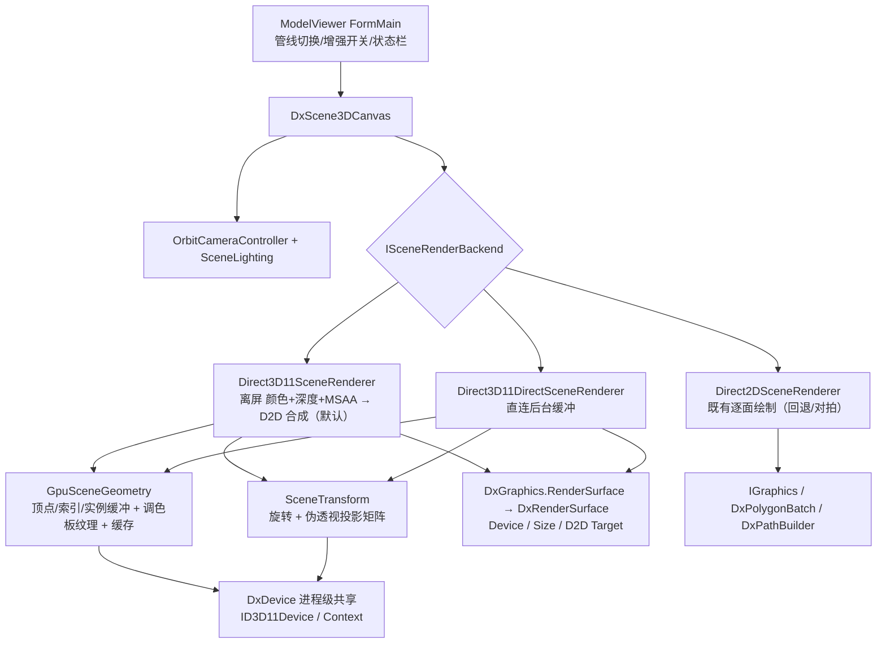

## 产品概述

现有三维模型查看器功能完整，但绘制方式是把每个面在 CPU 上逐帧旋转、投影、排序后再逐个多边形提交给 2D 画布，模型面数上万时只有约 10 帧/秒，交互卡顿。本轮把底层绘制替换为真正的三维几何管线：顶点变换、深度测试、着色器光照全部在图形设备上完成，每帧 CPU 只更新少量参数并提交绘制调用；同时把"绘制管线"做成可运行时切换的组件，便于对比、验证与故障回退，并把其中与界面无关的部分沉淀下来供其它项目复用。

## 核心功能

- 新增真三维渲染管线，覆盖三种渲染模式：表面渲染（逐面光照填充）、三角形网格（线框描边）、点云（方块点绘制与热图配色），并绘制地面网格。
- 渲染管线可在查看器内运行时切换（真三维管线为默认，保留原逐面绘制管线用于对比与回退），切换后立即生效。
- 质量增强开关：4x 多重采样抗锯齿、背面剔除；默认关闭以保持与原有画面一致，按需开启。
- 保持既有交互与画面口径不变：左键旋转、右键平移、滚轮缩放、重置视角、光照面板（方位/仰角/环境光/亮度/灯光颜色）、配色方案、点大小、使用点云自带颜色、显示地面、背景色、截图导出、调试叠层。
- 状态栏显示当前使用的绘制管线、图形设备信息与帧率。
- 与界面无关的三维场景绘制管线可被其它项目直接引用（场景容器、交互控制器、光照模型、可替换的绘制后端）。

## 功能与视觉效果

- 同一模型、同一视角下，使用真三维管线且关闭增强开关时，成像与原有画面逐像素一致（包括伪透视成像比例、逐面朗伯光照、法线朝向观察者的处理、线框不填充不排序的观感）。
- 开启抗锯齿后模型边缘更平滑；开启背面剔除后不可见面消失，观感更干净。
- 帧率由约 10 帧提升至显示刷新上限的流畅水平（数万面至数十万面、百万级点云下仍保持流畅），旋转/缩放/平移操作无卡顿，且首帧加载后每帧开销与模型面数基本无关（几何数据缓存在图形设备上，仅在模型或显示选项变化时重建）。
- 截图与图像导出结果与屏幕显示一致；当三维管线因环境不可用时自动回退到原绘制管线，功能不中断、界面无报错。

## 技术栈

- 语言/框架：VB.NET，`net10.0-windows`，WinForms（沿用现有工程配置，不改 TFM/版本号/Configurations）
- 图形 API：Direct3D 11（沿用本项目"纯托管 P/Invoke 互操作、无 C++/CLI、无 unsafe"的既定惯例）+ Direct2D / DirectWrite（既有 2D 与文本叠层）
- 着色器：HLSL，**运行时经 `d3dcompiler_47.dll` 的 `D3DCompile` 编译**（源码以字符串常量内置，已实测 `C:\Windows\System32\d3dcompiler_47.dll` 存在）
- 复用：`imaging.NET5` 的 `Drawing3D`（`Camera`/`Surface`/`Point3D`/`Light`）、`Landscape`（模型文件读取）；`DXApi` 既有 `DxDevice`/`DxRenderSurface`/`DxGraphics`
- 构建：`dotnet build`（DXApi → DxCanvas → ModelViewer）

## 实现方案

### 总体策略

采用"互操作层 → GPU 资源层 → 可插拔后端层"的三层结构，全部新增可复用逻辑落在 `DXApi` 的 `Scene3D` 命名空间与 `Native` 互操作目录内；`ISceneRenderBackend` 的公开契约（`Render(canvas As IGraphics, scene, camera, options)`）保持不变，因此新增后端对外零破坏，`DxScene3DCanvas` 与 `ModelViewer` 只需换默认实例与加 UI 项。

两个真三维后端（按用户选型都实现，默认 A）：

- **A `Direct3D11SceneRenderer`（默认）**：后端自持"颜色纹理 + 深度纹理"（可 4x MSAA + `ResolveSubresource`），HLSL 渲染完 3D 后经 `ID2D1Factory::CreateBitmapFromDxgiSurface` + `DrawBitmap` 合成到画布的 D2D 目标上。2D 叠层天然有序、可开抗锯齿、对画布封装无侵入。
- **B `Direct3D11DirectSceneRenderer`**：直接把交换链后台缓冲（或离屏纹理）作为渲染目标，零拷贝；需在 D2D `BeginDraw/EndDraw` 之间交错原生 D3D 命令（先 `ID2D1RenderTarget::Flush`，结束后恢复视口/RT/DSV/拓扑/着色器），不支持 MSAA，仅在底层表面为 `DxSwapChainTarget`/`DxRenderTarget` 时可用，否则回退 A/D2D。

### 性能设计（核心目标）

- 每帧 CPU 工作量降为常数：更新 1 个常量缓冲（`UpdateSubresource`，无需 Map）+ 1~3 次 Draw（表面/网格一次、地面一次、点云一次实例化 Draw）。
- 几何数据只在"场景版本号变化 / 显示选项变化（模式、配色、点大小、点云颜色来源）/ 设备或尺寸变化"时重建，彻底消除逐帧 `PointF[]` 分配、逐面排序与 D2D 路径几何构建（当前 ~10 FPS 的根因）。
- 表面/网格：非索引三角形列表，每面 3 个顶点（顶点内含面法线与面基色），`Draw(vertexCount)`；点云：静态单位方块 + 每点一条实例数据（位置/强度/可选自带色），`DrawIndexedInstanced`；调色板为 256x1 BGRA 纹理，像素着色器采样。
- 复杂度：渲染为 O(顶点数) 且完全并行于 GPU；CPU 每帧 O(1)（仅矩阵与常量缓冲）；构建为 O(面数/点数) 一次性成本。
- 线框用 `D3D11_FILL_MODE.WIREFRAME` 光栅化状态实现，无需 CPU 生成线段；`PointAlpha < 255` 时开 SrcAlpha/InvSrcAlpha 混合并关闭点云深度写。

### 必须逐字复刻的数学（保证成像与 CPU 版一致）

旋转矩阵（原 `Camera.RotationMatrix()` 为 `Private`，必须按公式复刻；角度为度，**行向量约定** `result.j = Σ v.i * M_ij`）：

```
radX=AngleX*π/180, radY=AngleY*π/180, radZ=AngleZ*π/180; cX=cos radX, sX=sin radX, ...
M11=cY*cZ              M12=cY*sZ               M13=-sY
M21=sX*sY*cZ-cX*sZ     M22=sX*sY*sZ+cX*cZ      M23=sX*cY
M31=cX*sY*cZ+sX*sZ     M32=cX*sY*sZ-sX*cZ      M33=cX*cY
M44=1，其余 M14/M24/M34/M41/M42/M43=0
```

投影矩阵（等价还原 `Point3D.Project` 的伪透视 `factor=fov/(ViewDistance+Zr)`、屏幕 Y 向下、`Offset` 为投影后屏幕像素平移；`W/H` 为画布像素尺寸，`A=2*fov/W`、`B=2*Offset.X/W`、`C=2*fov/H`、`D=2*Offset.Y/H`，`w=Zr+vd`）：

```
x_clip = A*Xr + B*Zr + B*vd
y_clip = -C*Yr - D*Zr - D*vd
z_clip = Zr + vd - near      ' depth = 1 - near/(Zr+vd)，随 Zr 单调递增，匹配 D3D 默认 LESS（远=1）
w      = Zr + vd
```

CPU 端以行向量约定组合 `WVP = R * P`（`Matrix4x4.Multiply`），**上传前转置**并在 HLSL 中统一使用 `mul(worldViewProj, float4(pos,1))`（列主序默认）。`near` 取 `max(0.001*Radius, 极小正数)`。

光照（复刻 `Light.ComputeLighting`）：面法线用前三个顶点 `cross(b-a, c-a)` 归一化；**在旋转后的相机空间**判 `normal.Z < 0` 则取反（朝向观察者）；`diffuse = max(0, dot(n_rot, LightDirection))`；`factor = Ambient + (1-Ambient)*diffuse`；`color = lerp(baseColor, LightColor, factor)`（基色取自面的 `SolidBrush.Color`，非 `SolidBrush` 取黑），Alpha 取基色 Alpha。因此需向着色器额外传入旋转矩阵（法线变换）。`Shade` 的 `Fix()` 截断与 GPU 的 UNORM 舍入允许 ±1/255 通道差。

其余模式口径：`Mesh` 不排序/不光照/用 `FromArgb(200,30,30,30)` 颜色；点云热图 `t` 由 `Intensity`（为 0 时回退 `Z`）在 `IntensityMin/Max` 间归一化并钳制后索引调色板，`UseEmbeddedColor` 且点自带色时用自带色；地面网格 `half=Radius*2`、`divisions=20`、`z=GroundZ`，21+21 条线（用同一 WVP 的 LineList）。

### 兼容性与回退

- 画布不是 `DxGraphics`、`d3dcompiler_47.dll` 缺失或 HLSL 编译失败、设备 WARP 下创建 MSAA 失败等情形：自动降级（MSAA→1x）或整体回退 `Direct2DSceneRenderer.Default`，并记录 `LastError` 供状态栏显示，**不抛异常、不崩溃**。
- 方案 B 只能作用于 `DxSwapChainTarget`/`DxRenderTarget`，否则自动改用方案 A。

## 架构设计



## 实现要点（执行细节与陷阱）

1. `Camera.RotationMatrix()` 为 `Private`，不可调用，必须按上表公式复刻（含行向量约定与度制）；`Camera.Draw(Graphics,...)` 在 `#If WINDOWS` 内且只接受 GDI+，真三维后端不得调用它。
2. `Offset` 是投影后的屏幕像素平移、`fov` 是像素焦距（`FitView` 设为 `256*8`），不可替换为常规 fov 角度，否则成像不一致。
3. D3D11 互操作必须**严格按真实 vtable 槽位顺序**声明（`ID3D11Device`：CreateBuffer(3)、CreateRenderTargetView(9)、CreateDepthStencilView(10)、CreateInputLayout(11)、CreateVertexShader(12)、CreatePixelShader(15)、CreateBlendState(20)、CreateDepthStencilState(21)、CreateRasterizerState(22)、CreateSamplerState(23)；`ID3D11DeviceContext`：VSSetShader(11)、PSSetShader(9)、DrawIndexed(12)、Draw(13)、DrawInstanced(14)、DrawIndexedInstanced(15)、IASetInputLayout(17)、IASetVertexBuffers(18)、IASetIndexBuffer(19)、IASetPrimitiveTopology(24)、OMSetRenderTargets(33)、OMSetBlendState(35)、OMSetDepthStencilState(36)、RSSetState(43)、RSSetViewports(44)、UpdateSubresource(48)、ClearRenderTargetView(50)、ClearDepthStencilView(53)、ResolveSubresource(57)），顺序错位会导致静默崩溃。
4. 复用既有互操作基础设施：`ComObject(Of T)`、`ComQuery`、`SafeRelease`、`ThrowIfFailed`、`DxConstants`；`DxDevice.Default` 为进程级共享设备，所有 D3D 资源必须建在该设备上才能与 D2D 共享表面。
5. 顶点数据用 `Single`（与 CPU 端投影输出一致）；`Scene` 需新增自增版本号，`SceneRenderOptions` 需新增增强选项并同步 `Clone()`。
6. 尺寸变化/设备丢失：`DxRenderSurface.NeedsRecreate` → `Recreate()` 后必须重建 3D 纹理、RTV/DSV、视口、MSAA 与调色板纹理；同时检测设备实例变化做全量重建。
7. 方案 A 合成前确保 D2D 变换为标识（`DxGraphics.BeginFrame` 已重置），并按 `(尺寸, 设备)` 缓存 D2D 位图包装，避免逐帧重建。
8. 方案 B 必须先 `Flush()` 再发原生 D3D 命令，用完后恢复视口/渲染目标/深度模板视图/拓扑/着色器，保证随后 D2D 叠层与 `EndDraw` 呈现正确。
9. `SaveImage`/`CaptureFrame` 会在 `Render` 之外触发一次同步重绘并再次触发 `Render`，后端在该路径必须幂等出帧且已完成合成；禁止在 `Render` 事件内调用。
10. `DxScene3DCanvas` 由 3D 后端负责清屏后应关闭 `AutoClear` 的重复 D2D 清屏，背景色统一由 `SceneRenderOptions.BackgroundColor` 驱动。
11. `DXApi` 根命名空间含 `Microsoft.VisualBasic.Math`/`Parallel`，新文件必须沿用 `Imports std = System.Math`、`Imports Tpl = System.Threading.Tasks.Parallel` 及 imaging 类型别名约定。
12. 不修改 `g:/GCModeller` 下任何工程；不改动三个工程的 NuGet 元数据、TFM、版本号与 `Configurations`；`test.vbproj` 不动。

## 目录结构

```
g:/Microsoft.VisualBasic.Drawing/src/
├── DXApi/
│   ├── Native/
│   │   ├── D3D11.vb                    # [MODIFY] 补齐设备工厂方法、上下文绘制/状态方法、缓冲与视图接口、深度/光栅/混合/采样状态、视口与各类枚举结构
│   │   ├── D3DCompiler.vb              # [NEW] D3DCompile 互操作 + ID3DBlob + 编译标志；缺失 dll 时抛可捕获异常供上层回退
│   │   ├── ComBase.vb                  # [MODIFY] 补充 IID_ID3D11Texture2D / IID_ID3DBlob 等常量（若缺）
│   │   └── D2D1.vb                     # [MODIFY] 确认/补充 ID2D1Bitmap 与 CreateBitmapFromDxgiSurface（方案 A 合成所需）
│   ├── DxGraphics.vb                   # [MODIFY] 新增 Friend ReadOnly Property RenderSurface As DxRenderSurface（同程序集内可见，不改变公开 API）
│   ├── DxRenderSurface.vb              # [MODIFY] 方案 B：新增可重写的后台纹理访问（ID3D11Texture2D）与失效通知，默认不支持以保持兼容
│   ├── DxRenderTarget.vb               # [MODIFY] 方案 B：暴露其 d3d11 纹理作为渲染目标
│   ├── DxSwapChainTarget.vb            # [MODIFY] 方案 B：从后台缓冲 IDXGISurface 再取 ID3D11Texture2D 并缓存，ResizeBuffers/Recreate 后失效重建
│   └── Scene3D/
│       ├── Scene.vb                    # [MODIFY] 新增自增 Version（供 GPU 缓冲缓存判定失效）
│       ├── SceneRenderOptions.vb       # [MODIFY] 新增多重采样档位与背面剔除开关，同步更新 Clone()
│       ├── SceneTransform.vb           # [NEW] 复刻旋转矩阵与伪透视投影矩阵，输出行向量约定 WVP、旋转矩阵与 near 选择
│       ├── GpuSceneGeometry.vb         # [NEW] CPU→GPU 几何构建与缓存：表面/网格顶点缓冲、点云实例缓冲与单位方块索引、地面 LineList、256x1 调色板纹理；按 Scene.Version + 选项指纹 + 设备/尺寸指纹管理生命周期与 Dispose
│       ├── Scene3DShaders.vb           # [NEW] 内置 HLSL 源码常量（表面/网格、点云实例、地面线、可选 MSAA）与输入布局描述
│       ├── Direct3D11SceneRenderer.vb  # [NEW] 方案 A 后端：离屏颜色+深度(+MSAA)→HLSL 三模式渲染→Resolve→经 D2D 位图合成；失败自动降级/回退
│       └── Direct3D11DirectSceneRenderer.vb # [NEW] 方案 B 后端：直连后台缓冲，D2D Flush 交错与状态恢复，MSAA 不可用
├── DxCanvas/
│   └── DxScene3DCanvas.vb              # [MODIFY] 默认后端切为 Direct3D11SceneRenderer；暴露管线/增强选项与切换事件；不可用时回退 D2D 后端并暴露回退原因
├── ModelViewer/
│   ├── FormMain.vb                     # [MODIFY] 绑定管线切换、MSAA/背面剔除开关、后端与设备信息、回退提示
│   └── FormMain.Designer.vb            # [MODIFY] 工具栏新增"渲染管线"下拉与两个质量增强复选项（沿用现有布局风格）
├── DXApi/README.md                     # [MODIFY] 增补真三维管线的能力、两个后端、增强开关与最小复用示例
└── DxCanvas/README.md                  # [MODIFY] 增补渲染管线切换与回退说明
```

## 关键代码结构（契约级）

HLSL 常量缓冲与输入布局（两个后端共用，是全篇一致的唯一契约）：

```
// 每帧一次：b0
cbuffer SceneConstants : register(b0) {
    float4x4 worldViewProj;   // R * P，上传前转置，列主序 mul(worldViewProj, float4(pos,1))
    float4x4 worldRotation;   // 仅 3x3 有效：法线在相机空间的 Z<0 翻转与光照点乘
    float4   lightDirection;  // 单位向量
    float4   lightColor;      // rgb = 光照颜色，a = ambient
    float4   shadingParams;   // x = 光照亮度系数，y = 点大小(px)，z = 调色板长度，w = 模式/开关位
};
// 表面/网格 VS 输入：POSITION(float3) + NORMAL(float3) + COLOR(float4)，均为逐面复制（天然平面着色）
// 点云实例输入：INSTANCE 位置(float3) + 强度(float) + 自带色(float4)
// 可选：调色板贴图 t0 + 线性采样器 s0（点云热图着色）
```

`DXApi` 内部最小暴露（不改变任何公开 API，方案 B 与合成所需）：

```
' DxGraphics.vb
Friend ReadOnly Property RenderSurface As DxRenderSurface   ' 供同程序集的 Scene3D 后端取 DxDevice / 尺寸 / D2D Target

' DxRenderSurface.vb（默认不支持，保持既有子类不受影响）
Friend Overridable ReadOnly Property RenderTargetTexture As ID3D11Texture2D  ' Nothing = 不支持直连
Friend Overridable Sub InvalidateRenderTarget()                               ' 后台缓冲重建后调用
```

## Agent Extensions

### SubAgent

- **code-explorer**
- Purpose: 在动手写互操作前，核对 `ID3D11Device`/`ID3D11DeviceContext` 现有声明的真实 vtable 槽位断点、`Native/D2D1.vb` 是否已声明 `ID2D1Bitmap` 与 `CreateBitmapFromDxgiSurface`、`Native/ComBase.vb` 已有的 `IID_*` 常量清单，并确认 `DxGraphics`/`DxRenderSurface`/`DxScene3DCanvas` 内部成员的可达性（同程序集 Friend 范围）。
- Expected outcome: 输出一份可直接落笔的互操作清单（需补的类型/方法/槽位顺序/IID、需新增的 Friend 成员及放置位置），避免 vtable 顺序错位导致的静默崩溃与返工。

### Skill

- **lsp-code-analysis**
- Purpose: 在改动 `ISceneRenderBackend` 使用方与 `DxScene3DCanvas`/`DxCanvas` 帧流程前做影响面分析，定位 `Renderer` 属性、`OnSceneRender`、`Render` 事件、`DxGraphics.RenderSurface` 的全部引用点。
- Expected outcome: 明确改动波及的调用点清单，确认新增后端与 Friend 成员不会破坏既有调用方，保证公开 API 兼容。