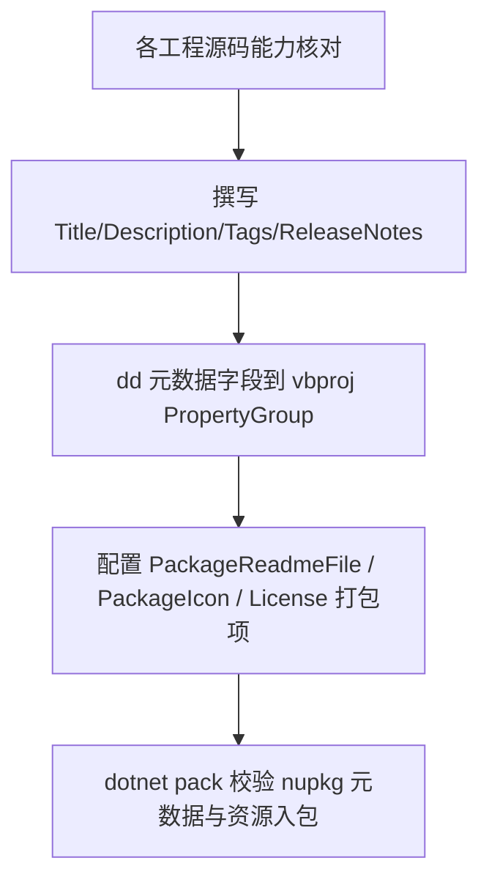

## 产品概述

对工作区 `g:/Microsoft.VisualBasic.Drawing/src` 下的 4 个类库工程进行 NuGet 包描述性元数据补全，使每个包的元数据与其源码实际功能一致、内容完整可发布，并配套提供 README.md 文档。

## 核心功能

- 扫描各工程源代码，据其真实功能撰写与之匹配的包元数据：Title、Description、PackageTags、PackageReleaseNotes，以及 Authors、Company、Copyright、PackageProjectUrl、RepositoryUrl 等辅助字段。
- 为每个可发布包提供 README.md，并将其作为 `PackageReadmeFile` 打包进 NuGet 包；主工程另有包图标。
- 覆盖范围（4 个库工程，`test` 演示 Exe 工程不改动）：
- `Microsoft.VisualBasic.Drawing`：基于 SkiaSharp 的 `System.Drawing` 跨平台替代实现，含 GDI 光栅、SVG、PDF 三类图形驱动，以及 TIFF 科学图像、终端 ANSI 图片预览、虚线特效、GIF 帧读取等能力。
- `DXApi`：纯托管 VB.NET + P/Invoke 封装的 Direct2D / D3D11 / DXGI / DirectWrite GPU 加速 2D 绘图后端，完成 `IGraphics` 全接口实现。
- `DxCanvas`：基于 DXGI flip 交换链与 D3D11 后台缓冲的 WinForms GPU 绘图控件，提供 Render 事件、Graphics 属性、自动清屏、垂直同步与帧导出。
- `TrueType`：TrueType 字体解析库（读取字形索引、名称、字距等元信息），原 Roy-T.TrueType 的 VB.NET 移植。
- 口径约定：各工程保持现有品牌与许可（主工程与 DXApi/DxCanvas 沿用 MIT，TrueType 保留 Roy-T 原作者信息）；TrueType 的 `PackageProjectUrl`、`RepositoryUrl`、作者、Tags 保持指向上游不变，仅补充 README 打包与 ReleaseNotes；DXApi 与 DxCanvas 开启 NuGet 打包并补全可发布所需元数据。

## 技术栈

- 工程格式：SDK 风格 VB.NET 工程（`.vbproj`，`Microsoft.NET.Sdk`），目标框架 `net10.0` / `net10.0-windows`（不修改）。
- 元数据承载：MSBuild 属性（`PackageXXX` 系列）+ 打包项（`<None Pack="True">`），由 `GeneratePackageOnBuild` 在构建时产出 nupkg（`PackageOutputPath` 沿用现状）。
- 文档：Markdown（README.md），英文文案，与现有工程及姊妹工程惯例一致。

## 实现方案

核心策略是「源码驱动文案、最小侵入改动」：先逐工程核对源码实际能力（类注释、公开 API、依赖），据此撰写准确的 Title/Description/Tags/ReleaseNotes；再仅在各 `PropertyGroup` 内追加/补全元数据字段，并以 `<None>` 打包 README 与图标。为维持可维护性，全部字段风格对齐同一解决方案内的姊妹工程 `Microsoft.VisualBasic.Imaging`（Title / Copyright / PackageProjectUrl / PackageReadmeFile / PackageIcon / RepositoryType / PackageTags（分号分隔）/ PackageReleaseNotes / Description / AssemblyTitle / Authors / Company）。

关键决策与取舍：

- 元数据只做「补全」不做「推倒重写」：主工程与 TrueType 已有字段（Version、License、Icon、Authors、PackageProjectUrl 等）一律保留原值，避免破坏既有发布流水与版本号；仅补齐缺失项。
- 打包件路径复用现成资源：图标统一复用仓库根 `logo-knot.png`（DXApi/DxCanvas/主工程相对路径均为 `..\..\logo-knot.png`），不新增二进制资源；主工程 README 复用仓库根 `README.md`，避免文档重复。
- TrueType 直接打包其现有 `src/TrueType/README.md` 与 `LICENSE`；因 `PackageId` 默认取 `AssemblyName`（`Microsoft.VisualBasic.Drawing.Fonts.TrueType`），而 README 内安装示例仍为上游 `RoyT.TrueType`，按「保留上游信息」口径保持上游章节与署名不变，仅在文档开头补充一小段「本构建为 VB.NET 移植版、实际包 id」说明，兼顾准确性与出处保留。
- DXApi 与 DxCanvas 目前是完全空白元数据，需按可发布包标准一次性配齐，并显式开启 `GeneratePackageOnBuild`；两者 `RootNamespace` 相同但 `AssemblyName` / `PackageId` 不同（`DXApi` 与 `Microsoft.VisualBasic.Drawing.DirectX.WinForm`），README 安装命令须据此书写。

性能与可靠性：本任务为静态配置/文档变更，无运行时性能影响；风险点在于 nupkg 中 README/Icon/License 必须真实入包，且 `PackageReadmeFile` 与实际打包项名称一致，否则 `dotnet pack` 会报错（NU5039/NU5041），故需在验证阶段检查 nupkg 内容清单。

## 实施要点（Execution Details）

- 不改动任何工程的 `TargetFramework`、`PackageReference`、`ProjectReference`、`Configurations`、`Version`/`AssemblyVersion`。
- `PackageTags` 统一使用分号分隔（与主工程/imaging 一致；TrueType 现有逗号分隔按「保留」口径不强制改写）。
- README 与图标打包项须为 `<None ... Pack="True" PackagePath="\" />`，且 `PackageReadmeFile` 取值与文件名精确匹配。
- 描述文案须与源码能力一一对应，不得写入项目未实现的功能（如 DXApi 的「纯托管、无 C++/CLI」、DxCanvas 的「DXGI flip swap chain」等均有源码依据）。
- 不改动 `test.vbproj`；新增文档不得改变现有构建产物结构。

## 架构设计

变更集中在一个维度：每个工程的 `vbproj` 元数据块 + 相邻的 README 文档资源。



## 目录结构

```
g:/Microsoft.VisualBasic.Drawing/
├── README.md                                                 # [MODIFY] 仓库根 README：补充功能特性/驱动模型/安装段落，作为主工程包 README 打包
├── logo-knot.png                                             # 复用现有包图标（不修改）
└── src/
    ├── Microsoft.VisualBasic.Drawing/
    │   └── Microsoft.VisualBasic.Drawing.vbproj              # [MODIFY] 补 Title/Description/PackageTags/PackageReleaseNotes/Authors/Company/Copyright/PackageProjectUrl/RepositoryUrl/RepositoryType/PackageReadmeFile；保留 MIT 与现有 Icon；新增根 README 打包项
    ├── DXApi/
    │   ├── DXApi.vbproj                                      # [MODIFY] 从零补全可发布元数据（MIT、Icon、Readme、Tags、ReleaseNotes、Authors、Company、Copyright、URL 等）并开启 GeneratePackageOnBuild/IncludeSymbols/snupkg
    │   └── README.md                                         # [NEW] DXApi 使用与能力说明（纯托管 P/Invoke、GPU 渲染目标、完整 IGraphics、性能优化、注册方式）
    ├── DxCanvas/
    │   ├── DxCanvas.vbproj                                   # [MODIFY] 从零补全可发布元数据并开启打包；PackageId 为 AssemblyName Microsoft.VisualBasic.Drawing.DirectX.WinForm
    │   └── README.md                                         # [NEW] DxCanvas 控件使用说明（Render 事件/Graphics 属性、AutoClear/BackgroundColor/VSync、SaveImage/CaptureFrame、生命周期与设备丢失）
    └── TrueType/
        ├── TrueType.vbproj                                   # [MODIFY] 补 Title/PackageReleaseNotes/PackageReadmeFile；打包本地 README.md；保留 Authors/URL/Tags/MIT(LICENSE) 不变
        └── README.md                                         # [MODIFY] 开头补充「本构建为 VB.NET 移植、实际包 id」说明，其余上游章节与署名保留
```

## 关键代码结构（元数据字段契约）

以下为 DXApi/DxCanvas 新增、其余工程补齐时应对齐的字段集合（值需依据各工程源码撰写）：

```xml
<PropertyGroup>
  <AssemblyTitle>...</AssemblyTitle>
  <Title>...</Title>
  <Description>...</Description>
  <PackageTags>...</PackageTags>
  <PackageReleaseNotes>...</PackageReleaseNotes>
  <Authors>...</Authors>
  <Company>...</Company>
  <Copyright>...</Copyright>
  <PackageProjectUrl>...</PackageProjectUrl>
  <RepositoryUrl>...</RepositoryUrl>
  <RepositoryType>git</RepositoryType>
  <PackageLicenseExpression>MIT</PackageLicenseExpression>
  <PackageReadmeFile>README.md</PackageReadmeFile>
  <PackageIcon>logo-knot.png</PackageIcon>
  <GeneratePackageOnBuild>true</GeneratePackageOnBuild>
  <IncludeSymbols>True</IncludeSymbols>
  <SymbolPackageFormat>snupkg</SymbolPackageFormat>
</PropertyGroup>
<ItemGroup>
  <None Include="README.md" Pack="True" PackagePath="\" />
  <None Include="..\..\logo-knot.png" Pack="True" PackagePath="\" />
</ItemGroup>
```

## Agent Extensions

### SubAgent

- **code-explorer**
- Purpose: 批量抽取 DXApi、DxCanvas、TrueType、主工程的公开类型/API 与关键类注释，作为 README 与 Description/ReleaseNotes 的事实依据，避免文案与实现不符。
- Expected outcome: 产出各工程可复用的能力清单（驱动注册、公开属性/事件/方法、支持的表格与格式），并据此定稿 README 章节。

### Skill

- **lsp-code-analysis**
- Purpose: 通过语义分析枚举各工程对外可见（Public）的符号与继承关系，精确校验 DxGraphics/DxCanvas/TrueTypeFont 等对外 API 名称与签名。
- Expected outcome: 得到准确的公开 API 清单，确保 README 中的类型名、属性名、方法签名与源码完全一致。